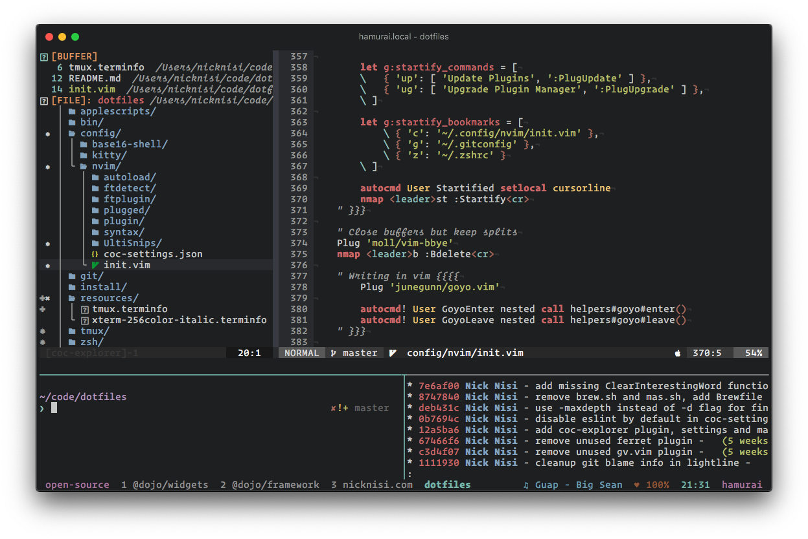

# Dotfiles

Welcome to my world. This is a collection of vim, tmux, and zsh configurations. Interested in a video walkthrough of the dotfiles? Check out my talk, [vim + tmux](https://www.youtube.com/watch?v=5r6yzFEXajQ).

Obviously this setup works for me, a JavaScript developer on macOS, but this particular setup may not work for you. If this particular setup doesn't work for you, please steal ideas from this and if you like, contribute back tips, tricks, and other tidbits via Pull Requests if you like!


## Contents

+ [Initial Setup and Installation](#initial-setup-and-installation)
+ [ZSH Setup](#zsh-setup)
+ [Vim and Neovim Setup](#vim-and-neovim-setup)
+ [Fonts](#fonts)
+ [Tmux](#tmux-configuration)

## Initial Setup and Installation

### Backup

First, you may want to backup any existing files that exist so this doesn't overwrite your work.

Run `install/backup.sh` to backup all symlinked files to a `~/dotfiles-backup` directory.

This will not delete any of these files, and the install scripts will not overwrite any existing. After the backup is complete, you can delete the files from your home directory to continue installation.

### Installation

If on OSX, you will need to install the XCode CLI tools before continuing. To do so, open a terminal and type

```bash
➜ xcode-select --install
```

Then, clone the dotfiles repository to your home directory as `~/.dotfiles`. 

```bash
➜ git clone https://github.com/nicknisi/dotfiles.git ~/.dotfiles
➜ cd ~/.dotfiles
➜ ./install.sh
```

`install.sh` will start by initializing the submodules used by this repository (if any). **Read through this file and comment out anything you don't want installed.** Then, it will install all symbolic links into your home directory. Every file with a `.symlink` extension will be symlinked to the home directory with a `.` in front of it. As an example, `vimrc.symlink` will be symlinked in the home directory as `~/.vimrc`. Then, this script will create a `~/.vim-tmp` directory in your home directory, as this is where vim is configured to place its temporary files. Additionally, all files in the `$DOTFILES/config` directory will be symlinked to the `~/.config/` directory for applications that follow the [XDG base directory specification](http://standards.freedesktop.org/basedir-spec/basedir-spec-latest.html), such as neovim.

Next, the install script will perform a check to see if it is running on an OSX machine. If so, it will install Homebrew if it is not currently installed and will install the homebrew packages listed in [`brew.sh`](install/brew.sh). Then, it will run [`osx.sh`](install/osx.sh) and change some OSX configurations. This file is pretty well documented and so it is advised that you __read through and comment out any changes you do not want__. Next, nginx (installed from Homebrew) will be configured with the provided configuration file. If a `nginx.conf` file already exists in `/usr/local/etc`, a backup will be made at `/usr/local/etc/nginx/nginx.conf.original`.

## ZSH Setup

ZSH is configured in the `zshrc.symlink` file, which will be symlinked to the home directory. The following occurs in this file:

* set the `EDITOR` to nvim
* Load any `~/.terminfo` setup
* Set the `CODE_DIR` variable, pointing to the location where the code projects exist for exclusive autocompletion with the `c` command
* Recursively search the `$DOTFILES/zsh` directory for files ending in .zsh and source them
* Setup zplug plugin manager for zsh plugins and installed them.
* source a `~/.localrc` if it exists so that additional configurations can be made that won't be kept track of in this dotfiles repo. This is good for things like API keys, etc.
* Add the `~/bin` and `$DOTFILES/bin` directories to the path
* And more...

### Prompt

The prompt is meant to be simple while still providing a lot of information to the user, particularly about the status of the git project, if the PWD is a git project. This prompt sets `precmd`, `PROMPT` and `RPROMPT`.

The `precmd` shows the current working directory in it and the `RPROMPT` shows the git and suspended jobs info.

#### Prompt Git Info

The git info shown on the `RPROMPT` displays the current branch name, and whether it is clean or dirty.

Additionally, there are ⇣ and ⇡ arrows that indicate whether a commit has happened and needs to be pushed (⇡), and whether commits have happened on the remote branch that need to be pulled (⇣).

#### Suspended Jobs

The prompt will also display a ✱ character in the `RPROMPT` indicating that there is a suspended job that exists in the background. This is helpful in keeping track of putting vim in the background by pressing CTRL-Z.

## Vim and Neovim Setup

[Neovim](https://neovim.io/) is a fork and drop-in replacement for vim. in most cases, you would not notice a difference between the two, other than Neovim allows plugins to run asynchronously so that they do not freeze the editor, which is the main reason I have switched over to it. Vim and Neovim both use Vimscript and most plugins will work in both (all of the plugins I use do work in both Vim and Neovim). For this reason, they share the same configuration files in this setup. Neovim uses the [XDG base directory specification](http://standards.freedesktop.org/basedir-spec/basedir-spec-latest.html) which means it won't look for a `.vimrc` in your home directory. Instead, its configuration looks like the following:

|                         | Vim        | Neovim                    |
|-------------------------|------------|---------------------------|
| Main Configuratin File  | `~/.vimrc` | `~/.config/nvim/init.vim` |
| Configuration directory | `~/.vim`   | `~/.config/nvim`          |

### Installation

Vim is likely already installed on your system. If using a Mac, MacVim will be installed from Homebrew. Neovim will also be installed from Homebrew by default on a Mac. For other systems, you may need to install Neovim manually. See their [web site](https://neovim.io) for more information.

[`link.sh`](install/link.sh) will symlink the XDG configuration directory into your home directory and will then create symlinks for `.vimrc` and `.vim` over to the Neovim configuration so that Vim and Neovim will both be configured in the same way from the same files. The benefit of this configuration is that you only have to maintain a single vim configuration for both, so that if Neovim (which is still alpha software) has issues, you can very seamlessly transition back to vim with no big impact to your productivity.

Inside of [`.zshrc`](zsh/zshrc.symlink), the `EDITOR` shell variable is set to `nvim`, defaulting to Neovim for editor tasks, such as git commit messages. Additionally, I have aliased `vim` to `nvim` in [`aliases.zsh`](zsh/aliases.zsh) You can remove this if you would rather not alias the `vim` command to `nvim`.

vim and neovim should just work once the correct plugins are installed. To install the plugins, you will need to open Neovim in the following way:

```bash
➜ nvim +PlugInstall
```

## Fonts

I am currently using [Operator Mono](http://www.typography.com/fonts/operator/styles/operatormonoscreensmart) as my default font which is a paid font ($199 US) and does not include Powerline support. You do not need this font at all and there is nothing directly referencing it in the setup. For a great, free programming font, check out Mozilla's [Fira](http://mozilla.github.io/Fira/). In addition to this, I do have [nerd-fonts](https://github.com/ryanoasis/nerd-fonts) installed and configured to be used for non-ascii characters via iTerm2's profile settings. If you would prefer not to do this, then simply remove the `Plug 'ryanoasis/vim-devicons'` plugin from vim/nvim.

## Tmux Configuration

Tmux is a terminal multiplexor which lets you create windows and splits in the terminal that you can attach and detach from. I use it to keep multiple projects open in separate windows and to create an IDE-like environment to work in where I can have my code open in vim/neovim and a shell open to run tests/scripts. Tmux is configured in [~/.tmux.conf](tmux/tmux.conf.symlink), and in [tmux/theme.sh](tmux/theme.sh), which defines the colors used, the layout of the tmux bar, and what what will be displayed, including the time and date, open windows, tmux session name, computer name, and current iTunes song playing. If not running on macOS, this configuration should be removed.

When tmux starts up, [login-shell](bin/login-shell) will be run and if it determines you are running this on macOS, it will call reattach-to-user-namespace, to fix the system clipboard for use inside of tmux.

## Questions

If you have questions, notice issues,  or would like to see improvements, please open an [issue](https://github.com/nicknisi/dotfiles/issues/new) and I'm happy to help you out!